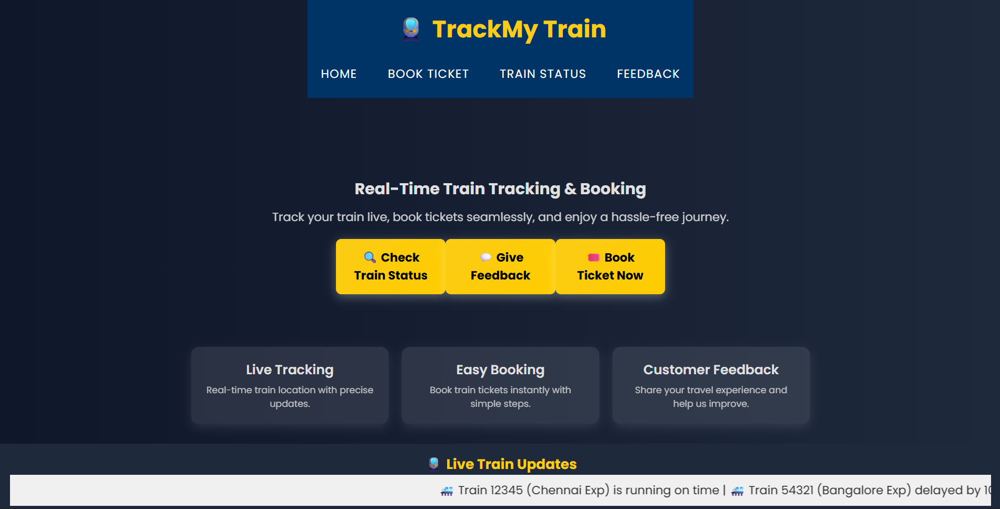
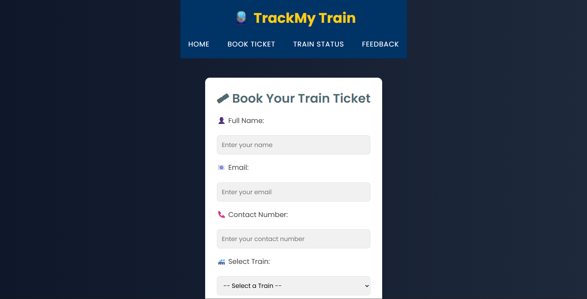
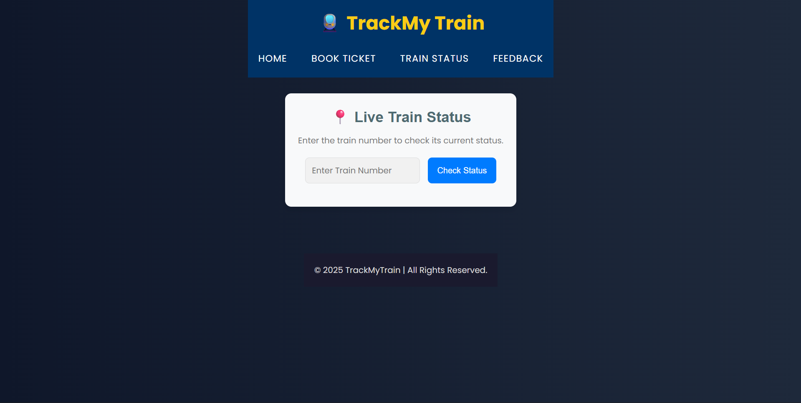
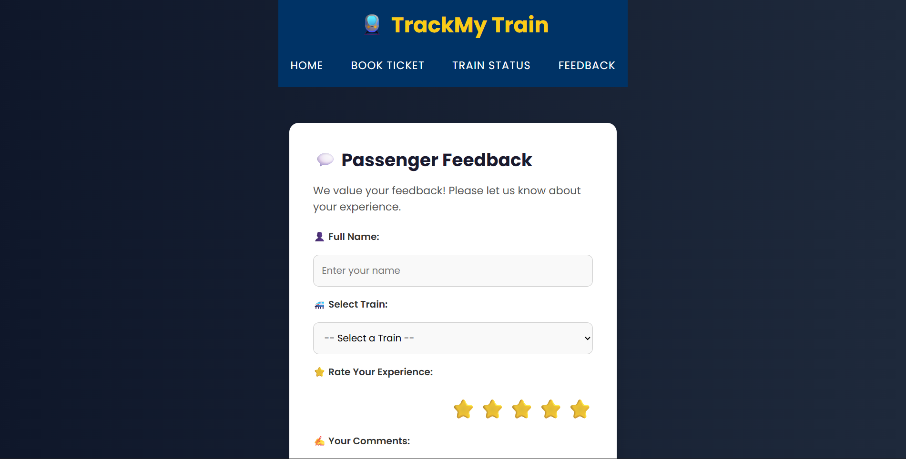

# 🚆 TrackMyTrain – Train Tracking & Ticket Booking System

TrackMyTrain is a **web-based train tracking and ticket booking application** developed using **Flask (Python)** and **MySQL**.  
The project allows users to **check train status**, **book train tickets**, and **submit feedback** through a simple and user-friendly interface.

This project is developed as part of **DBMS coursework**.

---

## 📌 Features

- 🏠 Home page with project overview
- 🎟️ Train ticket booking system
- 🚄 Live train status checking
- 💬 Passenger feedback submission
- 🗄️ MySQL database with foreign key constraints
- 🔐 Data integrity using DBMS relationships
- 🌐 REST-style APIs for train status

---

## 🛠️ Technologies Used

- **Frontend:** HTML, CSS, JavaScript  
- **Backend:** Python (Flask)  
- **Database:** MySQL  
- **Tools:** VS Code, Git, GitHub  

---

## 📂 Project Structure

```text
TrackMyTrain/
│
├── app.py
│
├── templates/
│   ├── index.html
│   ├── booking.html
│   ├── feedback.html
│   └── train_status.html
│
├── static/
│   ├── css/
│   │   └── styles.css
│   └── images/
│       └── favicon.ico
│
├── database/
│   ├── db_connection.py
│   └── db_operations.py
│
└── README.md

```
🗄️ Database Design

trains – stores train details
bookings – stores ticket booking details
feedback – stores passenger feedback
stations – stores station names

✔ Foreign key constraint is used between bookings.train_id and trains.train_id to ensure data integrity.

🚀 How to Run the Project Locally

1️⃣ Clone the Repository
git clone https://github.com/rayaan-24/TrackMy-Train.git
cd TrackMyTrain

2️⃣ Create Virtual Environment (Optional)
python -m venv venv
venv\Scripts\activate

3️⃣ Install Dependencies
pip install flask mysql-connector-python

4️⃣ Configure Database

🗄️ MySQL DATABASE & TABLES (RUN THIS)
✅ Create Database

CREATE DATABASE trackmytrain_db;

USE trackmytrain_db;

🚆 Trains Table

CREATE TABLE trains (
    train_id VARCHAR(10) PRIMARY KEY,
    train_name VARCHAR(100),
    source VARCHAR(50),
    destination VARCHAR(50),
    status VARCHAR(50),
    last_updated TIMESTAMP DEFAULT CURRENT_TIMESTAMP
);

🎟️ Bookings Table

CREATE TABLE bookings (
    booking_id INT AUTO_INCREMENT PRIMARY KEY,
    passenger_name VARCHAR(100),
    email VARCHAR(100),
    train_id VARCHAR(10),
    journey_date DATE,
    seat_number VARCHAR(10),
    class VARCHAR(20),
    fare INT,
    FOREIGN KEY (train_id) REFERENCES trains(train_id)
);

⭐ Feedback Table

CREATE TABLE feedback (
    feedback_id INT AUTO_INCREMENT PRIMARY KEY,
    passenger_name VARCHAR(100),
    Train_ID VARCHAR(10),
    Rating INT,
    Comments TEXT,
    Date DATE
);

🚉 Stations Table

CREATE TABLE stations (
    station_id INT AUTO_INCREMENT PRIMARY KEY,
    station_name VARCHAR(100)
);

Update credentials in:

database/db_connection.py

5️⃣ Run the Application
python app.py


Open in browser:

http://127.0.0.1:5000/


## 📸 Application Screenshots

### 🔹 Home Screen


### 🔹 Booking Screen


### 🔹 Train_status Screen


### 🔹 feedback Screen


🎓 Academic Use

Subject: DBMS / Web Development

Concepts Used:

Foreign Key Constraints
Flask Routing
Template Rendering
REST APIs

🔮 Future Enhancements

User authentication (Login / Signup)
Admin dashboard
Real-time train data integration
Online payment gateway
Mobile application version

👨‍💻 Author

MOHAMMED RAYAAN N
BCA Student – VIT Vellore

🔗 GitHub: https://github.com/rayaan-24

⭐ If you like this project, give it a star!
